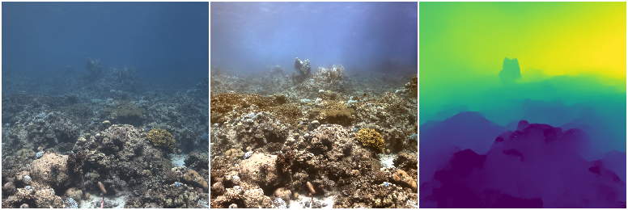
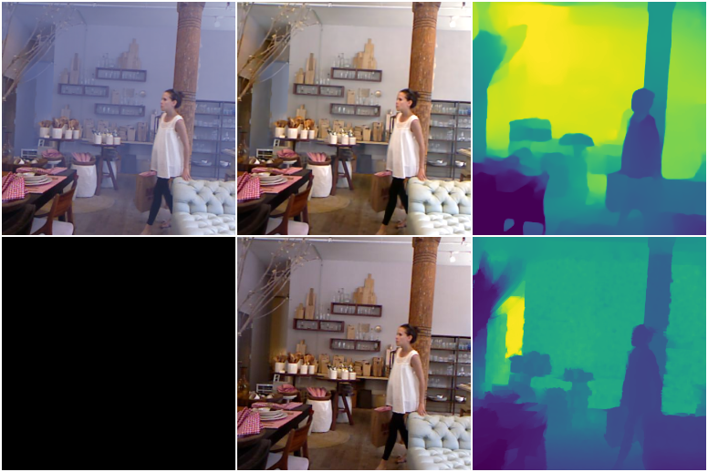
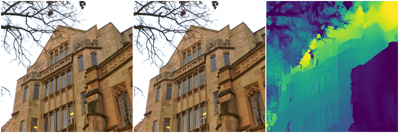
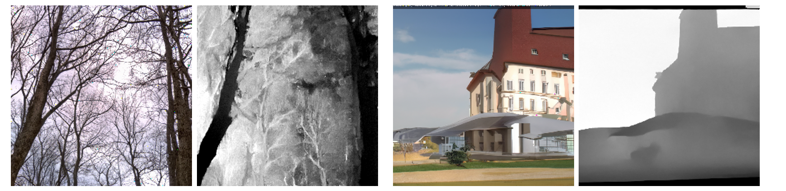
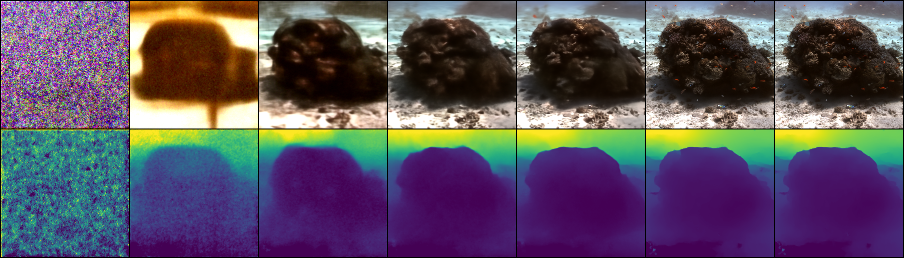

# Osmosis: RGBD Diffusion Prior for Underwater Image Restoration

### <!--[Paper](link) , -->[Project Page](https://osmosis-diffusion.github.io/)

> Osmosis: RGBD Diffusion Prior for Underwater Image Restoration
>
> [Opher Bar Nathan](mailto:barnathanopher@gmail.com) | [Deborah
> Levy](https://www.linkedin.com/in/deborah-levy-78a290b1/) | [Tali Treibitz](https://www.viseaon.haifa.ac.il/) | [Dan Rosenbaum ](https://danrsm.github.io/)

This repository contains official PyTorch implementation for **Osmosis: RGBD Diffusion Prior for Underwater Image
Restoration**.


This code is based on [guided-diffusion](https://github.com/openai/guided-diffusion)
and [DPS](https://github.com/DPS2022/diffusion-posterior-sampling).

## Abstract

In this work, our proposed method takes an underwater-captured image as input and outputs a restored image, free from
the effects of the water medium, along with a depth estimation of the scene.
Notably, our method operates with a single image as input.
We show how to leverage in-air images to train diffusion prior for underwater restoration. We observe that only color
data is insufficient, and augment the prior with a depth channel.
Thus, we train an unconditional diffusion model prior on the joint space of color and depth, using standard RGBD
datasets of natural outdoor scenes in air.
Using this prior together with a novel guidance method based on the underwater image formation model, we generate
posterior samples of clean images, effectively eliminating the water effects.
Despite the trained prior not being exposed to underwater images, our method successfully performs image restoration and
depth estimation on underwater scenes.

## RGBD Prior

In the course of this research, an unconditional Diffusion Probabilistic Model (DDPM) is trained on RGBD (color image
and depth map) data. The training follows [improved-diffusion](https://github.com/openai/guided-diffusion)
and [guided-diffusion](https://github.com/openai/guided-diffusion).
To adapt the model for RGBD data (instead of RGB), we made specific modifications by adjusting the UNet input layer to
handle 4 channels and the output layers to generate 8 channels.

<!--We initialize the model by a pre-trained unconditional DDPM on ImageNet, provided by [guided-diffusion](https://github.com/openai/guided-diffusion)-->

The new prior is trained using 4 outdoor RGBD datasets: [DIODE](https://diode-dataset.org/) (only outdoor
scenes), [HRWSI](https://github.com/KexianHust/Structure-Guided-Ranking-Loss?tab=readme-ov-file), [KITTI](https://www.cvlibs.net/datasets/kitti/)
and [ReDWeb-S](https://github.com/nnizhang/SMAC).

The trained RGBD prior, named "osmosis_outdoor.pt," can be downloaded from the
provided [link](https://drive.google.com/file/d/13o2roYPI-2wDOh8LvPHGQIrqRommSuJT/view?usp=drive_link)

## Datasets

The method is specifically designed for underwater scenes.

Consequently, underwater images are supplied, and simulated data was also examined for quantitative analysis.

Furthermore, the algorithm exhibits versatility for additional tasks such as dehazing, hence, a set of images with haze
is included.


<br />

### Underwater images - real data - [link](https://drive.google.com/drive/folders/1mJnCn0cnoR-aO4pieBWYvTSPGwA9ZUx-?usp=sharing)

This directory contains the real world underwater images showcased in both the paper and the appendix.

This folder contains two similar datasets.

- **Low** Resolusion
  set - [link](https://drive.google.com/drive/folders/1opAVMZvh_bPtDIjW6FuaiHpRCkZ76pc4?usp=drive_link) - 256x256
- **High** Resolusion set - [link](https://drive.google.com/drive/folders/1mwrOnwe1qd_Krk87VZl3q25xzR3uPje2?usp=drive_link)

Both datasets contain identical images, with the *Low-Resolution Set* serving as a cropped and resized version of the
*High-Resolution Set* images.

Our method accepts input images of any resolution, but it standardizes the resolution by resizing them to 256 pixels on
the smaller side and subsequently center cropping them.

The underwater images are sourced from three
datasets: [SQUID](https://zenodo.org/records/5744037),
[SeaThru](https://csms.haifa.ac.il/profiles/tTreibitz/datasets/sea_thru/index.html), 
[SeaThru-Nerf](https://sea-thru-nerf.github.io/) 
and additional scenes captured by [Dr. Derya Akkaynak](https://www.deryaakkaynak.com/), Matan Yuval and Deborah Levy.

The images are linear (were not undergo any non-linear processing) and undergo a white balance process.

<br />

### Underwater images - Simulated data with Ground Truth - [Link](https://drive.google.com/drive/folders/1FDDneIPYveXgVkX8UmeqOL0_LiqrvkC5?usp=sharing)

As part of this study, underwater scenes were simulated to facilitate quantitative comparisons.

Images are sourced from the indoor dataset 
[NYUv2](https://cs.nyu.edu/~silberman/datasets/nyu_depth_v2.html),
each accompanied by its corresponding depth map. 
This dataset comprises a total of 1449 images.

Each simulation includes 3 folders:

1. input - the simulated images
2. gt_rgb - Ground Truth color images
3. gt_depth - Ground Truth depth maps

<br />

### Hazed images - [link](https://drive.google.com/drive/folders/18Xpy8MdsIucNIRhTTKD_Q3isbC79TW89?usp=sharing)

We present preliminary results of applying this method to the dehazing task, therefore, we provide several images
captured in hazed conditions.

<br />

### RGB Guidance Setup

To evaluate the trained RGBD prior, we subject both natural outdoor images and underwater images to the diffusion
sampling process. The objective is to guide the process towards generating an RGB image similar to the input and
examining the depth map generated by the prior.

Several images are available in the ```./data/rgb_guidance/``` directory for examination.

<br />

### Using your own data

In case you would like to try this method on your own data:

- Place all images in the same folder.
- In the configurations file, modify the field ``` data: root: <path> ``` to the folder path.
- Specify the name in the ``` data: name: <dataset_name> ``` field; the results will be saved into a folder with the
  same name.
- If there is ground truth data, indicate its path in the ``` data: gt_rgb: <path> ```
  and ``` data: gt_depth: <path> ``` fields. Change the flag ``` data: ground_truth: True ``` (similar to the
  configurations in ```osmosis_simulation_sample_config.yaml```).
- If your data is not simulated or is not include linear images, setting the flag ``` degamma_input: True ``` often
  produces improved results.

<br />

## Prerequisites

See the environment file: [link](environment.yml)


<br />

## Getting started

### 1) Clone the repository

```
git clone https://github.com/osmosis-diffusion/osmosis-diffusion-code

cd osmosis-diffusion-code
```

<br />

### 2) Download pretrained checkpoint and data

### Checkpoint

If such a directory does not exist, create a new directory named ```./models```.

From the [link](https://drive.google.com/file/d/13o2roYPI-2wDOh8LvPHGQIrqRommSuJT/view?usp=drive_link), download the
checkpoint "osmosis_outdoor.pt" into ```./models/``` directory.

<br />

### Datasets

If such a directory does not exist, create a new directory named ```./data```.

Download the relevant [dataset](#datasets) into ```./data/``` directory.


<br />

### 3) Set environment

For This section there are two options:
1) Setting of local environment
2) Build Docker image

### Option 1 - Local environment setting

Install dependencies

```
conda create -n osmosis python=3.8

conda activate osmosis
```
See dependencies at environment.yml file - [link](environment.yml)

### Option 2 - Build Docker image

Before executing the following commands, ensure that the Docker engine, GPU driver, and appropriate CUDA are installed.

If using the Docker image, ensure that the data paths, model path, and results path are in the working directory.

Navigate to the ```osmosis-diffusion-code``` directory (where the project was cloned), and run the following commands in the command line:

Build a Docker image
```
docker build -t osmosis_docker .
```

Run docker image on **Windows**:
```
docker run -v %cd%:/home/osmosis-diffusion-code --gpus all -it --rm osmosis_docker
```

Run docker image on **Linux**:
```
docker run -v $(pwd):/home/osmosis-diffusion-code --gpus all -it --rm osmosis_docker
```

<br />


### 4) Inference

The configuration file structure is thoroughly outlined in this [section](#structure-of-configurations-file),
enabling users to modify configurations and fine-tune parameters for experimental purposes.

By default, results are saved in the directory ```./results/<operator name>/<dataset name>/<date>/<run#>```.

Additionally, both a log file and configuration file are stored in the same path.

To execute inference from the command line, navigate to the running directory and specify the Python file to run along
with two arguments:

- The first argument is the required configuration file (```-c <path to config file>```)
- The second argument is the device ID (GPU) to run the inference on, default is 0. (```-d <device id>```)

```
python <script_name>.py -c <path to config file> -d <device id> 
```

There are several examples bellow.

<br />

**There are 5 possible configurations:**

#### a) Underwater Image Restoration and Depth Estimation - real data

Relevant for real underwater images.

```
python osmosis_sampling.py -c ./configs/osmosis_sample_config.yaml
```

On the left is an underwater image, serving as the input to our method. In the middle is the restored RGB image, and on
the right is the depth estimation, where blue represents close distances and yellow farther distances.



<br />

#### b) Underwater Image Restoration and Depth Estimation - simulated data

Applicable to simulated underwater images, where both the Ground Truth RGB image and depth map are provided.

```
python osmosis_sampling.py -c ./configs/osmosis_simulation_sample_config.yaml
```

The first row is the same as above.
On the left is a simulated underwater image, serving as the input to our method. In the middle is the restored RGB
image, and on the right is the depth estimation, where blue represents close distances and yellow farther distances.
In the second row, there is the ground truth RGB image and the depth map.



<br />

#### c) Hazed Image Restoration and Depth Estimation

Relevant for images in haze environment.

```
python osmosis_sampling.py -c ./configs/osmosis_haze_sample_config.yaml
```

On the left is a simulated underwater image, serving as the input to our method. In the middle is the restored RGB
image, and on the right is the depth estimation, where where blue represents close distances and yellow farther distances.


<br />

#### d) RGB Guidance

Here, guidance is exclusively based on the colored (RGB) image, with the objective of making the output RGB image
closely resemble the input image.

The depth map is subsequently estimated using prior information.

```
python osmosis_sampling.py -c ./configs/rgb_guidance_sample_config.yaml
```

On the left is the input image. In the middle is the restored RGB image, designed to closely resemble the input image.
On the right is the depth estimation, where blue represents close distances and yellow farther distances.



<br />

#### e) Sample from RGBD Prior - **Without** guidance

In this scenario, there is no guidance provided for the sampling process, resulting in the production of an RGB image
and its corresponding depth map.

The absence of guidance implies no constraints on achieving a visually coherent image.

```
python RGBD_prior_sampling.py -c ./configs/RGBD_sample_config.yaml
```

Each pair of images (RGB image and depth map) is generated from the prior without any guidance on the sampling process.
Here, black indicates close distances, and white represents farther distances.



<br />

## Structure of configurations file

In this section the structure and the *relevant* fields in the configuration file are explained.

```
save_dir: ./results    # saving directory path

degamma_input: False # should be True in case of NOT linear images, or NOT simulated images, otherwise False
manual_seed: 0       # manuual seed for the diffusion sampling process
rgb_guidance: False   # relevant only for the check prior inference

save_singles: True   # save single results images - 1)reference image (input), 2)restored RGB image and 3)depth estimation image
save_grids: True     # save grid of the results, next to each other

record_process: True # record the sampling process
record_every: 200    # in case "record_process: True" - record every <value> steps (in this case - 200)

# change unet input and output - for RGBD - it is
change_input_output_channels: True
input_channels: 4   # RGBD
output_channels: 8  # RGBD * 2 - learning sigma = True, if False 4

sample_pattern:     # the diffusion sampling pattern for the 
  pattern: pcgs     # original, pcgs - from gibbsDDRM

  # relevant only for "pattern: pcgs"
  # update phi's
  update_start: 0.7    # optimizing phi's (<value>*T)
  update_end: 0        
  global_N: 1          # repeat several times the T steps
  local_M: 1           # number of iterations between update x_t and optimizing phis for the same t - time step
  n_iter: 20           # for each t step, the number of optimization steps for te phi's
  
  start_guidance: 1    # PGDiff - when to guide? no guidance at all not in the range (<value>*T)
  stop_guidance: 0


unet_model:                               # unet model configurations
  model_path: ./models/osmosis_outdoor.pt # pretrained model path
  pretrain_model: osmosis                 # pretrained model name

conditioning:
  method: osmosis                       # conditioning method - osmosis, ps 

params:    
    loss_weight: depth                 # none, depth # if "none" so the rest has no meaning
    weight_function: gamma,1.4,1.4,1   # function,original- [0,1], gamma=((x+value[0])*value[1])^value[2]
    scale: 7,7,7,0.9                   # guidance scale for each channel (RGBD)
    gradient_clip: True,0.005          # gradient clipping value (is True)

# specify the loss and its weight/scale, if not specified so no auxiliary loss
# see the paper for details on the losses
aux_loss:
  aux_loss:
    avrg_loss: 0.5        # scale of average loss
    val_loss: 20          # scale of value loss

data:
  name: osmosis                      # dataset name
  root: .\data\underwater\high_res   # path of the dataset
  ground_truth: False                # if the dataset includes ground truth - True, else - False
  gt_rgb: .\data\simulation_1\gt_rgb        # dataset ground truth paths - comment when no GT data
  gt_depth: .\data\simulation_1\gt_depth    # dataset ground truth paths - comment when no GT data


measurement:
  operator:

    name: underwater_physical_revised # underwater_physical_revised, haze_physical, noise (for check prior)
    optimizer: sgd                    # water parameters optimizer - options are adam, sgd

    depth_type: gamma                 # original- [0,1], gamma=((x+value[0])*value[1])^value[2]
    value: 1.4,1.4,1

    phi_a: 1.1,0.95,0.95              # initalized values
    phi_a_eta: 1e-5                   # step size for the optimization
    phi_a_learn_flag: True            # optimization flaf - if False, there is no optimization for this parameter  

    phi_b: 0.95, 0.8, 0.8             # initalized values
    phi_b_eta: 1e-5                   # step size for the optimization
    phi_b_learn_flag: True            # optimization flaf - if False, there is no optimization for this parameter  

    phi_inf: 0.14, 0.29, 0.49         # initalized values
    phi_inf_eta: 1e-5                 # step size for the optimization
    phi_inf_learn_flag: True          # optimization flaf - if False, there is no optimization for this parameter  

  noise:                              # added noise
    name: clean                       # clean - osmosis, gaussian - ps
    # sigma: 0                      # comment in case of "clean" uncomment in case of "gaussian"

```

### Results Directory

The results are saved in the directory specified by the ```save_dir: <path>``` parameter in the configuration file.

Subdirectories are created within the specified ```<path>``` based on ```measurement: operator: name: <operator_name>```, 
```data: name: <data_name>```, current date and run number, to prevent overwriting existing files.

Individual images are stored in the ```single_images``` directory, 
while grid results (consisting of the input image, restored RGB, and predicted depth displayed side by side) 
and process are saved under ```grid_results```.

The path for *single images* will be: ```<path>/<operator_name>/<data_name>/<today_date>/<run_number>/single_images/```.

For example:  ```<path>/underwater_physical_revised/simulation/21-6-24/run2/single_images/```.


### Process Records

In case you would like to see how the sampling process looks like, set those fields to True and specify a value in
the ```record_every: <value>``` field.

```
save_grids: True     
record_process: True 
record_every: 200    
```

An example: (the process starts from left to right and sampled every 200 time step)

The first row shows the predicted image on that step, and the second row shows the depth map in that step, where blue
represents close distances and yellow farther distances.



<br />

## Citation

If you find our code relevant to your project, please refer by setting a link to this github repository.

<!--
If you find our work interesting, please consider citing

```
@inproceedings{
blabla2024osmosis,
title={},
author={{,
booktitle={},
year={},
url={}
}
```
-->
